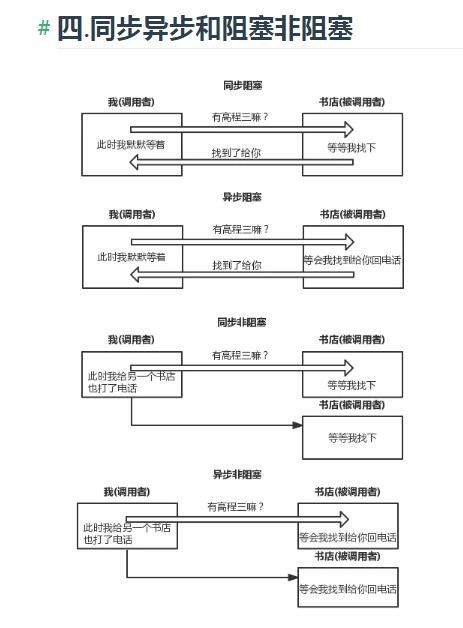

# node

#### 1.什么是高阶函数(1.callback\1.high-order.js)
- 1。如果一个函数的参数是一个函数（回调函数就是一种高阶函数）
- 2.如果一个函数返回一个函数，当前这个函数也是一个高阶函数

#### 2.判断变量的类型(1.callback\2.high-order.js)
- 常用的判断类型的方法有四种
  - 1.typeof  不能判断对象类型 
  - 2.constructor  可以找到这个变量是通过谁构造出来的
  - 3.instanceof  判断谁是谁的实例 __proto__
  - 4.Object.prototype.toString.call()  缺陷就是不能细分是谁谁的实例

#### 3.柯理化函数(1.callback\2.high-order.js)
- 是把接受多个参数的函数变换成接受一个单一参数（最初函数的第一个参数）的函数，并且返回接受余下的参数而且返回结果的新函数的技术
- 其实就是高阶函数的一个特殊用法
```javascript
function isType(type,value){
    return Object.prototype.toString.call(value)===`[object ${type}]`;
}
const currying=(fn,arr = []) =>{
    let len = fn.length;//拿到函数的参数个数
    return function(...args){//高阶函数      
        arr=[...arr,...args];
        if(arr.length<len){
            return currying(fn,arr);//递归不停的产生函数
        }else{
            return fn(...arr);
        }
    }
}
let isArray = currying(isType)('Array');
let isString = currying(isType)('String');

console.log(isArray([]));
console.log(isString('123'));

// function sum(a,b,c,d,e,f){
//     return a+b+c+d+e+f
// }
// let r = sum(1,2)(3,4)(5)(6)
```
#### 4.发布订阅
- 发布订阅模式  主要分成两个部分  on  emit
- on 就是把一些函数维护到一个数组中
- emit 就是让数组中的方法依次执行
```javascript
// 观察者模式  有观察者  肯定有被观察者  观察者需要放到被观察者中，被观察者的状态发生变化需要通知观察者，我变化了

// 内部也基于发布订阅模式，  收集观察者  状态变化后要通知观察者

class Subject{//被观察者  小宝宝
    constructor(name){
        this.name=name;
        this.state ='开心的';
        this.observers =[];
    }
    attach(o){
        this.observers.push(o);
    }
    setState(newState){
        this.state=newState;
        this.observers.forEach(o=>o.update(this))
    }
}

class Observer{//观察者  我  我媳妇
    constructor(name){
        this.name = name
    }
    update(baby){
        console.log('当前'+this.name+'被通知了','当前宝宝的状态是'+baby.state);    
    }
}

// 我和我媳妇  需要观察小宝宝的心里状态的变化
let baby = new Subject('小宝宝');
let parent = new Observer('爸爸');
let mother = new Observer('妈妈');
baby.attach(parent)
baby.attach(mother)
baby.setState('被欺负了')
```
#### 5.promise
- https://promisesaplus.com/ 这个网址有   promiseA+ 规范，都是通过这个规范来实现的
- promise  es6 内部已经实现了。ie不支持promise，需要polyfill  es6-promise
- promise缺陷默认无法中断，只是不采用返回的结果

- promise 为什么会产生  解决异步问题
  - 1.解决多个异步请求并发  （希望同步最终的结果） Promise.all
  - 2.链式异步请求的问题，上一个人的输出是下一个人的输入  Promise的链式调用可以解决这个问题
  - 3.缺陷：还是基于回调的
- promise的特点 ：promise就是一个类
- 1.promise 有三个状态：成功态（resolve）  失败态（reject） 等待态（pending又不成功又不失败）
- 2.用户自己决定失败的原因和成功的原因 ，成功和失败也是用户定义的
- 3.promise默认执行器时立即执行
- 4.promise的实例都拥有一个then方法，一个参数是成功的回调，另一个是失败的回调
- 5.如果执行函数时发生了异常也会执行失败逻辑
- 6.如果promise一旦成功就不能失败，反过来也是一样的


- 1.promise 成功和失败的回调的返回值  可以传递到外层的下一个then
- 2.如果返回的是普通值的话（传递到下一次的成功中，不是错误不是promise就是普通值），出错的情况（一定会走到下一次的失败），可能还要promise的情况（会采用promise的状态，决定走下一次的成功还是失败）
- 3.错误处理  如果离自己最近的then  没有错误处理  会向下找
- 4.每次执行完promise.then方法返回的都是一个“新的promise”（promise一旦成功或失败就不能修改状态）

- Promise.resolve();//快速创建一个成功的promise
- Promise.reject();//快速的创建一个失败的promise
- 区别在于resolve会等待里面的promise执行完毕  reject  不会有等待效果(Promise.reject() 已经报错了 就直接走到catch了)

- finally表示不是最终的意思，而是无论如何都会执行的意思
- 如果返回一个promise 会等待这个promise  也执行完毕  （如果是失败的promise  会用他的失败原因传给下一个人）

- all 全部成功才成功
 
- promises 将node的api快速的转换成promise的形式
```
const fs = require('fs').promises;
```

- race 赛跑  谁跑的快用谁的（多个接口 请求，我希望采用快的那个）

```
// 这里是链断掉
Promise.resolve(100).then().then(()=>{
    return new Promise((resolve,reject)=>{

    })
}).then(data=>{
    console.log(data);
},err=>{
    console.log(err);
})
```

#### 6. 异步：并发（使用for循环迭代执行）  和 串行（借助回调  第一个的输出是下一个的输入,第一个完成后调用第二个）

#### 7.generator生成器（202003jiagou\node\3.async\4.generator.js）


- 原理generator 生成器 =》 遍历器(需要有一个next方法)=》 数组 =》  类数组 
- generator函数是es6提供的语法，如果碰到yield 就会“暂停”执行 （redux-sage,koa1中）

-  it就是迭代器，迭代器上有个next方法

- async + await = generator + co
- async await 替换掉了generator 和 co 默认async 函数执行后返回的就是一个promise


#### tips
- 1.对promise理解正确的是
  - promise解决了回调地狱的问题|promise方便处理多个异步并发请求|promise错误处理非常优雅和方便
- 2.请分类选出是微任务的有哪些    
  - Promise.then
  - nextTick
  - MutationObserver
  - MessageChannel


#### 浏览器事件环
- 1.浏览器的进程
  - 每一个页卡都是进程 (互不影响)
  - 浏览器也有一个主进程 (用户界面)
  - 渲染进程 每个页卡里 都有一个渲染进程 (浏览器内核)
  - 网络进程 （处理请求）
  - GPU进程 3d绘制
  - 第三方插件的进程

- 2.渲染进程（包含着多个线程）
  - GUI渲染线程 （渲染页面的）
  - js引擎线程 他和页面渲染时互斥
  - 事件触发线程 独立的线程 EventLoop
  - 事件 click、setTimeout、ajax也是一个独立线程
  

- 进程是计算机调度的基本单位 进程中包含着线程
- 进程的面试题（G:\202003jiaogou3\node\5.review）

- 3.宏任务,微任务
  - 宏任务 宿主环境提供的异步方法 都是宏任务 script ui 渲染
  - 微任务 语言标准提供promise mutationObserver


### node 
#### Node的基本概念

#### 一.Node是什么?
Node.js是一个基于 Chrome V8 引擎的JavaScript运行环境(runtime),Node不是一门语言是让js运行在后端的运行时,并且不包括javascript全集,因为在服务端中不包含DOM和BOM,Node也提供了一些新的模块例如http,fs模块等。Node.js 使用了事件驱动、非阻塞式 I/O 的模型，使其轻量又高效并且Node.js 的包管理器 npm，是全球最大的开源库生态系统。事件驱动与非阻塞IO后面我们会一一介绍。到此我们已经对node有了简单的概念。

#### 二.Node解决了哪些问题?
Node在处理高并发,I/O密集场景有明显的性能优势

- 高并发,是指在同一时间并发访问服务器
- I/O密集指的是文件操作、网络操作、数据库,相对的有CPU密集,CPU密集指的是逻辑处理运算、压缩、解压、加密、解密

`Web主要场景就是接收客户端的请求读取静态资源和渲染界面,所以Node非常适合Web应用的开发`

#### 三.JS单线程
javascript在最初设计时设计成了单线程,为什么不是多线程呢？如果多个线程同时操作DOM那岂不会很混乱？这里所谓的单线程指的是主线程是单线程的,所以在Node中主线程依旧是单线程的。

- 单线程特点是节约了内存,并且不需要在切换执行上下文
- 而且单线程不需要管锁的问题.

#### 四.同步异步和阻塞非阻塞
  

- 阻塞和非阻塞 针对的是调用方
> 我调用了一个方法之后的状态 fs.readFile

- 同步异步 针对的是被调用方
> 我调用了一个方法 ，这个方法会给我说他是同步的还是异步的

- 异步非阻塞 （我调用了一个方法，这个方法是异步的，我不想要等待这个方法执行完毕）
- http 第一个请求 要计算 100万个数相加 第二个请求来了，需要等待第一个人计算完成

> https://nodejs.org/zh-cn/docs/guides/event-loop-timers-and-nexttick/

- node官方文档，事件轮询机制
>https://nodejs.org/zh-cn/docs/guides/event-loop-timers-and-nexttick/
```
// node和前端的区别 前端里面有dom bom 服务端中没有widnow

// 服务端中有global属性  全局对象
// console.log(Object.keys(global));

// process 进程（重要）
// Buffer 类型来处理二进制文件
// clearInterval、clearTimeout
// setInterval、setTimeout
// clearImmediate、setImmediate 宏任务


// 浏览器以前的方法 还是可以使用的只是默认没有被枚举出来
// console.dir(global,{showHidden:true})


// 1.process 默认取值时会像global中查找 (node中有一个模块化系统，是以文件为单位的，每个文件都是一个模块，模块中的this被更改了   {});

// (1)console.log(process.platform); // 可以用这个属性来判断当前执行的系统环境  win32 darwin

// (2)console.log(process.argv); // 1.node.exe  2.node当前执行的文件 （解析用户自己传递的参数）
// 执行node文件 node 文件名 a b c d  (webpack --mode --config --port --progress)

// let args = process.argv.slice(2);
// [ '--port', '3000', '--color', 'red', '--config', 'a.js' ]

// let obj = {}
// args.forEach((item,index) => {
//     if(item.startsWith('--')){
//         obj[item.slice(2)] = args[index+1]
//     }
// });
// console.log(obj);
// (commander TJ) (yargs webpack)  npm  github


// 在npm上的模块都需要先安装在使用 (模块内部也提供了几个属性，也可以在模块中直接访问 - 参数)
const program = require('commander');
// program.version('1.0.0')
//     .command('create').action(()=>{
//         console.log('创建项目')
//     })
//     .name('node')
//     .usage('my-server')
//     .option('-p,--port <v>', 'set your port')
//     .option('-c,--config <v>', 'set your config file')
//     .parse(process.argv); // -- 开头的是key  不带--是值


// 当用户在哪执行node命令时 就去哪找配置文件  webpack
// console.log(process.cwd()); // 当前用户的工作目录 current working directory  (这个目录可以更改，用户自己切换即可 )
// console.log(__dirname); // 当前文件的所在的目录 这个目录是不能手动修改的

// console.log(process.env.b); // 环境变量  可以根据环境变量实现不同的功能
// window set key=value  mac export key=value  这样设置的环境变量是临时的变量

// let domain = process.env.NODE_ENV === 'production'? 'localhost':'zfpx.com';

// (1)node中自己实现的微任务  nextTick / queueMicrotask
// console.log(process.nextTick);

// (2)node中setImmediate 宏任务

// 常见面试题 node中的事件环和浏览器中的区别
// 微任务有哪些 宏任务有哪些

// 浏览器的事件环和node事件环 执行效果现在是一致的了

setImmediate(() => {
    console.log('setImmediate')
    setTimeout(() => { // 进入事件环时 setTimeout 有可能没有完成
        console.log('timeout')
    }, 1000);
});


// const fs = require('fs');
// // poll 完成后 setImmediate -> setTimeout
// fs.readFile('./name.txt',()=>{
//     setTimeout(() => { // 进入事件环时 setTimeout 有可能没有完成
//         console.log('timeout')
//     }, 0);
//     setImmediate(() => {
//         console.log('setImmediate')
//     });
// })

// process.nextTick 并不属于事件环的一部分  在本轮代码执行后执行 

setTimeout(() => {
    console.log(1);
    Promise.resolve().then(()=>{
        console.log('then')
    })
    process.nextTick(()=>{
        console.log('nextTick')
    })
}, 0);
setTimeout(() => {
    console.log(2);
}, 0);


// vue的源码 nextTick 方法 描述了浏览器中常见的 宏任务和微任务

// 宏任务 script / ui / setTiemout / setInterval /requestFrameAnimation / setImmediate / MessageChannel  异步的  click  ajax

// 语言的本身提供的 promise.then mutationObserver nextTick
```

## module

## 模块化规范
- Node中的模块化规范 commonjs规范(node自己实现的), es6Module(import export), umd 统一模块规范 (如果浏览器不支持commonjs requirejs,直接将变量放到window上)，amd规范 requirejs cmd规范 seajs


## commonjs规范（模块的概念）
- 可以把复杂的代码拆分成小的模块，方便管理代码和维护
- 每个模块之间的内容都是相互独立的，互不影响的 (解决变量冲突的问题)  单例模式(不能完全解决,命名空间) 使用自执行函数来解决  

规范的定义：
- 每个文件都是一个模块
- 如果你希望模块中的变量被别人使用，可以使用module.exports 导出这个变量
- 如果另一个模块想使用这个模块导出的结果 需要使用require语法来引用 （同步）


## 模块的分类
- require('fs') 核心模块、内置模块 不是自己写的，也不是安装来的是node中自己提供的,可以直接使用
- require('commander');  别人写的模块，通过npm install 安装过来的 就是第三方模块，不需要有路径
- 自定义模块 require('./promise.js'); 自定义模块就是自己写的模块 引用时需要增加路径(相对路径,绝对路径)


## 核心模块
- fs(fileSystem处理文件的)  path(处理路径)  vm（虚拟机模块 沙箱环境）


// 所有的方法基本上都是同步方法、异步方法
// 同步：如果刚刚运行程序可以去使用同步的方法
// 异步：开启一个服务监听客户端访问，就需要使用异步了  异步是非阻塞的 


